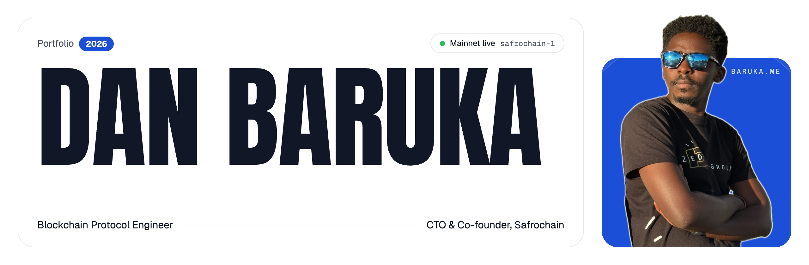
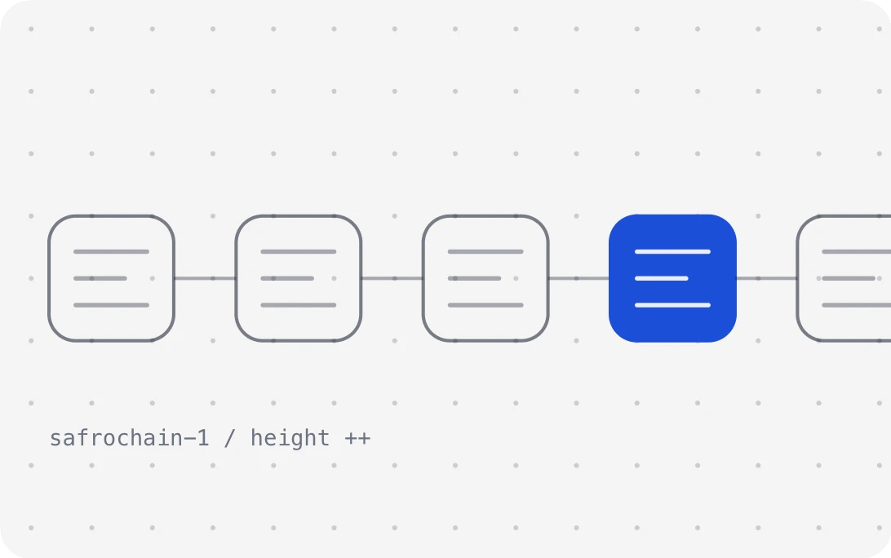
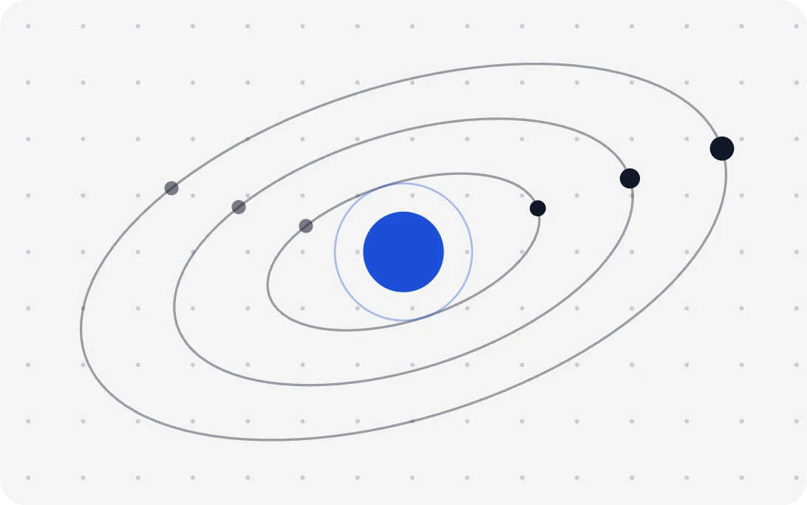
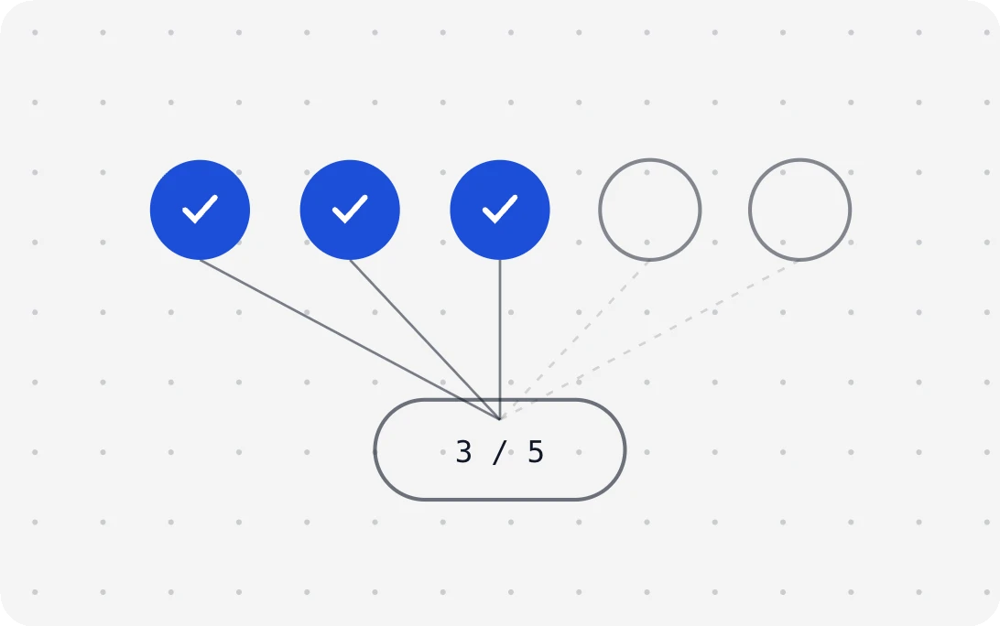
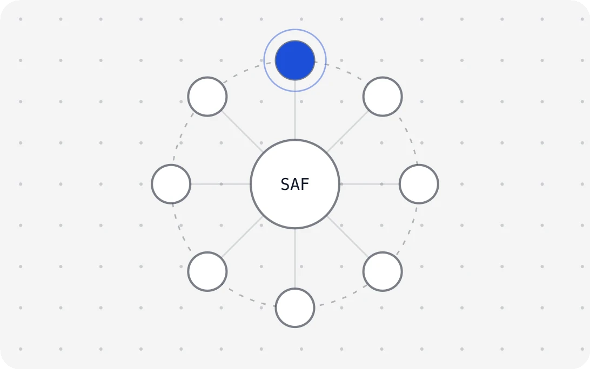
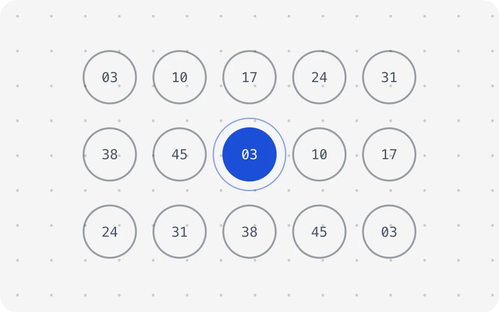
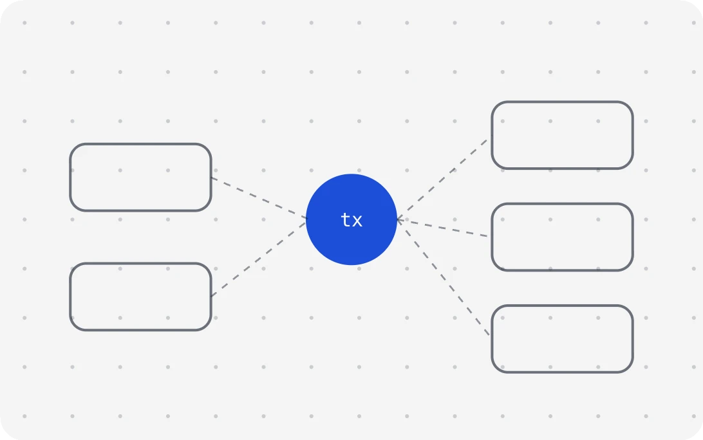

<a href="https://baruka.me">
  <picture>
    <source media="(prefers-color-scheme: dark)" srcset="./assets/banner-dark.webp">
    
  </picture>
</a>

  
  
  

  <a href="https://baruka.me"><b>baruka.me</b></a> &nbsp;·&nbsp;
  <a href="https://baruka.me/en/cv">CV</a> &nbsp;·&nbsp;
  <a href="https://www.linkedin.com/in/danbaruka">LinkedIn</a> &nbsp;·&nbsp;
  <a href="https://x.com/danamphred">X</a> &nbsp;·&nbsp;
  <a href="https://t.me/danbaruka">Telegram</a> &nbsp;·&nbsp;
  <a href="https://devcommunity.io/profile/danamphred">Writing</a> &nbsp;·&nbsp;
  <a href="mailto:danbaruka01@gmail.com">Email</a>

### I build and run Layer 1 blockchains.

As **CTO and co-founder of [Safrochain](https://safrochain.com)**, I took a Cosmos SDK Layer 1 from the Juno codebase to a live mainnet (`safrochain-1`, June 2026), and I still run it every day: upgrades, validators, IBC, the indexer, the explorer and the people who build on it. The network counts **100,000+ wallets** and **millions of transactions**.

I also founded **[Zunia Lab](https://zunialab.com)**, a self-custody Cosmos wallet for 262 chains, and I'm a **Developer Advocate at [Intersect](https://www.intersectmbo.org)** for Cardano. Seven years building software, five in blockchain. Based in Nairobi, working remotely (UTC+3).

### Selected work

<table>
  <tr>
    <td width="50%" valign="top">
      <a href="https://baruka.me/en/work/safrochain"><picture><source media="(prefers-color-scheme: dark)" srcset="./assets/work/safrochain-dark.webp"></picture></a>
      
<a href="https://baruka.me/en/work/safrochain"><b>Safrochain</b></a> &nbsp;LAYER 1 · 2025

      
Community-first Cosmos SDK Layer 1, live on mainnet since June 2026. I architected it and still run it.

      
Go · Cosmos SDK · CometBFT · IBC · CosmWasm <a href="https://safrochain.com">safrochain.com</a> · <a href="https://github.com/Safrochain-Org/safrochain-node">code</a> · <a href="https://explorer.safrochain.com">explorer</a>

    </td>
    <td width="50%" valign="top">
      <a href="https://baruka.me/en/work/zunia-wallet"><picture><source media="(prefers-color-scheme: dark)" srcset="./assets/work/zunia-wallet-dark.webp"></picture></a>
      
<a href="https://baruka.me/en/work/zunia-wallet"><b>Zunia Wallet</b></a> &nbsp;WALLET · 2025

      
Self-custody, IBC-native Cosmos wallet: browser extension and mobile on the same keys, 262 chains.

      
TypeScript · Rust · Flutter · CosmJS <a href="https://zunialab.com">zunialab.com</a> · <a href="https://github.com/Zunia-Lab/zunia-extension">code</a> · <a href="https://chromewebstore.google.com/detail/zunia/ngokakoekdogobjmokipglbcclelgajk">Chrome Web Store</a>

    </td>
  </tr>
  <tr>
    <td width="50%" valign="top">
      <a href="https://baruka.me/en/work/smultisig"><picture><source media="(prefers-color-scheme: dark)" srcset="./assets/work/smultisig-dark.webp"></picture></a>
      
<a href="https://baruka.me/en/work/smultisig"><b>SMultisig</b></a> &nbsp;TOOLING · 2025

      
Non-custodial K-of-N threshold multisig for teams, with canonical SignDoc verification before every broadcast.

      
Cosmos SDK multisig · Amino · ADR-036 · Next.js <a href="https://smultisig.safrochain.com">smultisig.safrochain.com</a>

    </td>
    <td width="50%" valign="top">
      <a href="https://baruka.me/en/work/safrimba"><picture><source media="(prefers-color-scheme: dark)" srcset="./assets/work/safrimba-dark.webp"></picture></a>
      
<a href="https://baruka.me/en/work/safrimba"><b>Safrimba</b></a> &nbsp;SMART CONTRACTS · 2025

      
Decentralized savings circles: Likelemba, the rotating tontine, on-chain with SAF or USDC payouts.

      
CosmWasm · Rust <a href="https://safrimba.safrochain.com">safrimba.safrochain.com</a> · <a href="https://github.com/Safrochain-Org/safrimba-smartcontract-v0">code</a>

    </td>
  </tr>
  <tr>
    <td width="50%" valign="top">
      <a href="https://baruka.me/en/work/winsaf"><picture><source media="(prefers-color-scheme: dark)" srcset="./assets/work/winsaf-dark.webp"></picture></a>
      
<a href="https://baruka.me/en/work/winsaf"><b>WinSaf</b></a> &nbsp;SMART CONTRACTS · 2025

      
Provably fair on-chain lottery inside Telegram: beacon-backed draws, MPC 2-of-3 wallets, every round verifiable.

      
CosmWasm · Rust · Telegram <a href="https://winsaf.xyz">winsaf.xyz</a>

    </td>
    <td width="50%" valign="top">
      <a href="https://baruka.me/en/work/cots"><picture><source media="(prefers-color-scheme: dark)" srcset="./assets/work/cots-dark.webp"></picture></a>
      
<a href="https://baruka.me/en/work/cots"><b>COTS</b></a> &nbsp;CARDANO · 2025

      
Cardano Offline Transaction Simulator: test transactions and Plutus scripts without a node.

      
Haskell · Plutus · SQLite <a href="https://github.com/danbaruka/COTS">code</a>

    </td>
  </tr>
</table>

Also: <a href="https://explorer.safrochain.com">SafroExplorer</a> · <a href="https://github.com/Safrochain-Org/safrochain_indexer">Safrochain Indexer</a> · <a href="https://github.com/Safrochain-Org/safhandle-contract">SAFHANDLE</a> · <a href="https://github.com/Safrochain-Org/MoMoTrack-Oracle">MoMoTrack Oracle</a> · <a href="https://ibcmap.zunialab.com">IBC Map</a> · <a href="https://baruka.me/en/work"><b>all projects</b></a>

### Stack

<table>
  <tr><td><b>Chain</b></td><td>Cosmos SDK v0.50 · CometBFT · IBC (ICS-20, relayers) · CosmWasm · Token Factory · genesis and on-chain upgrades · validator operations</td></tr>
  <tr><td><b>Languages</b></td><td>Go · Rust · TypeScript · Dart · Haskell (Plutus) · Python</td></tr>
  <tr><td><b>Wallets</b></td><td>CosmJS · InterchainJS · Keplr and Leap · WalletConnect v2 · Ledger and Keystone · Amino multisig · ADR-036</td></tr>
  <tr><td><b>Infra</b></td><td>Callisto · PostgreSQL · NestJS · Docker · GitHub Actions · goreleaser · Kubernetes · AWS</td></tr>
</table>

### Latest writing

<!-- WRITING:START -->
- [Local devnet, preprod, and mainnet](https://devcommunity.io/post/7c832517-e582-49e0-8921-e9833df3952d) Oct 2, 2026
- [Where Midnight sits among ZK, FHE, and MPC](https://devcommunity.io/post/69bb6616-c999-4d86-be5b-b77be22d226a) Sep 27, 2026
- [Safrochain Technical Update: Injective USDC Is Live](https://devcommunity.io/post/3b0ae1bf-72e5-4f75-97f9-9affdc311278) Sep 23, 2026
- [A review checklist before disclose()](https://devcommunity.io/post/993d13ad-e955-4f45-a0c4-6a038cbe8612) Sep 16, 2026
- [Compact types that surprise TypeScript developers](https://devcommunity.io/post/00dc8894-a0a8-472d-8c11-7fb0616d21af) Sep 4, 2026

[All articles on baruka.me](https://baruka.me/en/writing)
<!-- WRITING:END -->

### Community

- **Developer Advocate** at Intersect (Cardano), Cohort 2
- **Maintainer** of [IntersectMBO/developer-experience](https://github.com/IntersectMBO/developer-experience), top contributor
- **Mentor and speaker**, Cardano Africa Tech Summit 2026 · **Host**, Cardano Summit community event, Goma 2024
- **Co-founder** of [Dev Community](https://devcommunity.io), a developer platform with 2,000+ members

 

Open to senior protocol engineering roles and consulting in the Cosmos ecosystem · <a href="https://baruka.me/en/contact">get in touch</a>

